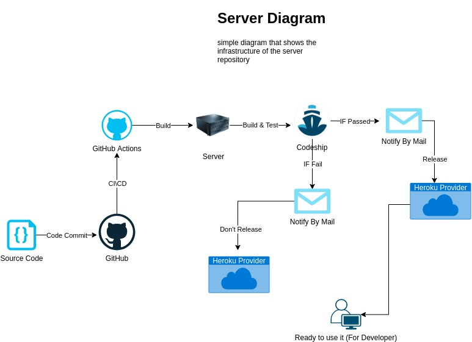
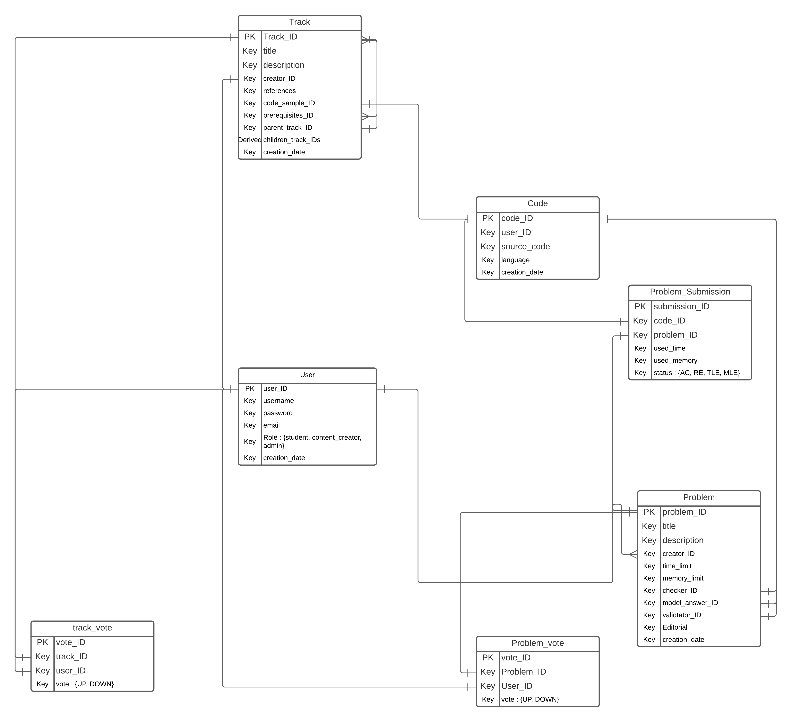

# Back-End
       
<h3 align="center"> Diagram </h3>

  
 
  <h3 align="center"> ERD </h3>
  
  

## For Edit ER
[Lucid Chart](https://lucid.app/lucidchart/invitations/accept/963cae70-9c0d-404d-9958-65b8d3d9c283)

# Production
[AlgoSolver-Server](https://algosolver-server.herokuapp.com)
